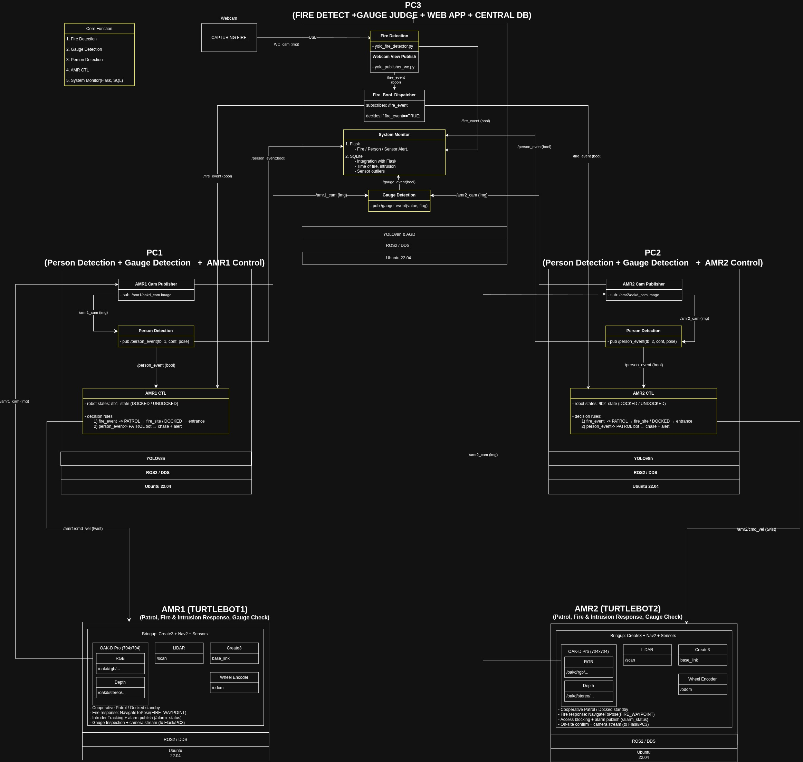
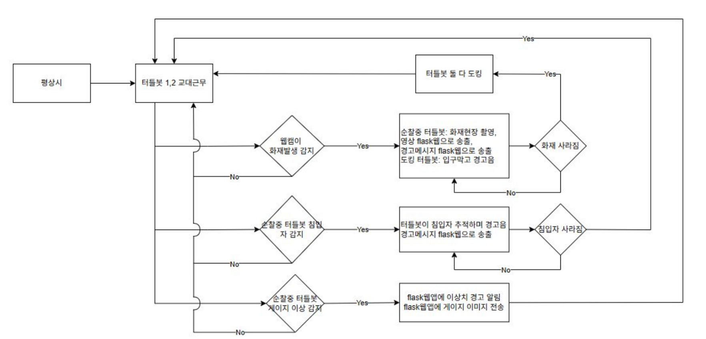

# 🏭 생산 시설 통합 경비 AI 자율주행 시스템

**SLAM 기반 화재/센서 탐지 및 경비용 자율주행 로봇 시스템**입니다.  
YOLOv8 기반 실시간 객체 탐지, LLM 연동 공정 모니터링 UI, 멀티 AMR 통합 운영을 구현합니다.

---

## 📋 프로젝트 개요

| 항목 | 내용 |
|------|------|
| **기간** | 2026.01.13 ~ 2026.01.26 |
| **목적** | SLAM 기반 생산 시설 화재/센서 탐지 및 경비용 자율주행 로봇 시스템 구현 |
| **역할** | Detection 모델 개발, LLM 기반 시스템 모니터링 UI, 전체 시스템 아키텍처 설계 |
| **핵심 역량** | `YOLOv8 모델 활용` `데이터 엔지니어링` `Flask 웹 개발` `LLM 활용` |

이 workspace가 실행 된 pc는 pc3로, 서버이자 system monitor, gauge detection, fire detection을 담당한 pc입니다.


---

## 🛠️ Tech Stack

* **Robot Control**: Python, ROS 2 Humble, AMR (Autonomous Mobile Robot)
* **AI & Vision**: **YOLOv8** (화재/게이지 탐지), OpenCV
* **Web Server**: Flask (멀티 페이지 라우팅, 실시간 스트리밍)
* **LLM Integration**: Gemini 1.5 Flash API (공정 현황 AI 요약)
* **Generative AI**: Grok Imagine (시스템 소개 영상 제작)

---

## 📂 Project Structure

```text
ssy_ws/
├── 01_data/                  # 객체탐지 모델 개발에 활용된 데이터셋
├── 02_yolo_codes/            # 객체탐지 모델 실행 파일들
├── 03_system_monitor/        # 시스템 모니터링 UI
│   └── ssy_system_monitor_v12_LLM/
│       ├── app.py            # 시스템 모니터 메인 실행
│       ├── gauge_final.py    # 게이지 Detection
│       └── yolo_fire_start_publisher.py  # Fire Detection
├── 04_sys_arch_dgrm/         # System Architecture Diagram 모음
├── 05_grok_video/            # 생성형 AI를 이용한 시스템 소개 영상
├── 06_AMR/                   # 경비용 AMR 자율주행 map, yaml 파일
├── 07_PPT/                   # 최종 발표 PPT 자료
└── 99_storage/               # 기타 파일들
```

---

## 🌟 Key Features

### 1. Defect Detection Model (화재/게이지 탐지)

* **YOLOv8** 모델을 직접 수집한 커스텀 데이터셋으로 파인튜닝하여 화재 및 계기판(게이지) 이상 상태를 실시간 탐지합니다.
* mAP50 **99.5%**, 추론 속도 약 **10.4ms** 달성.

### 2. Multi-AMR Monitoring UI (멀티 AMR 모니터링)

* AMR 3대의 실시간 영상 스트리밍을 통합 모니터링하는 **Flask 기반 웹 UI**를 구현합니다.
* 메인 페이지 / 서브 페이지 라우팅 분리로 렌더링 부하를 최적화하고, Compressed 이미지 토픽으로 네트워크 안정성을 확보합니다.

### 3. LLM-based Process Summary (LLM 공정 현황 요약)

* AMR이 공장 내부를 교대 순찰하며 수집한 센서 데이터를 기반으로 **Gemini 1.5 Flash API**를 통해 "오늘의 공정 현황 AI 요약" 기능을 구현합니다.

### 4. AI-generated Introduction Video (생성형 AI 소개 영상)

* **Grok Imagine**을 활용하여 시스템이 실제 공장 현장에 적용된 모습을 담은 소개 영상을 제작합니다.

---

## 🚀 Installation & Running

### Requirements

* **OS**: Ubuntu 22.04 LTS
* **ROS**: ROS 2 Humble
* **Python Libraries**:
  ```bash
  pip install ultralytics opencv-python flask numpy
  ```

### 실행 순서

```bash
# 1. 서버 켜기
server-on

# 2. Fire Detection 노드
python3 ssy_ws/03_system_monitor/ssy_system_monitor_v12_LLM/yolo_fire_start_publisher.py

# 3. 게이지 Detection
python3 ssy_ws/03_system_monitor/ssy_system_monitor_v12_LLM/gauge_final.py

# 4. 시스템 모니터 UI 실행
python3 ssy_ws/03_system_monitor/ssy_system_monitor_v12_LLM/app.py
```

---

## 📊 Detection Model Results

| 지표 | 결과 |
|------|------|
| **mAP50** | 99.5% |
| **추론 속도** | 약 10.4ms |
| **Validation 신뢰도** | 69% → **97%** (하이퍼파라미터 튜닝 후) |

---

## 🔧 Trouble Shooting

### 1. Detection 모델 신뢰도 개선

직접 촬영한 소규모 데이터셋 특성을 고려하여 `mosaic`·`mixup` 하이퍼파라미터를 조정했습니다.  
과도한 데이터 증강이 오히려 성능 저하를 유발하고 있었음을 파악하고, 증강 강도를 낮춰 Validation 신뢰도를 **69% → 97%**로 개선했습니다.

### 2. Multi-AMR UI Flask 렌더링 부하 최적화

단일 화면에서 3개의 고해상도 실시간 영상을 동시 렌더링하는 과정에서 Flask 서버 및 브라우저 리소스 과부하가 발생했습니다.

* **라우팅 분리**: 사용자 UI의 메인 페이지-LiveFeed 서브 페이지 구조로 분할하여 페이지당 하나의 실시간 영상 스트림만 렌더링하도록 구조 변경
* **토픽 변경**: 일반 이미지 토픽 → **Compressed 이미지 토픽**으로 전환하여 데이터 송수신량 절감 및 네트워크 안정화

### 3. LLM 기반 모니터링 UI 아이디어 제안

AMR 순찰 데이터를 기반으로 **Gemini 1.5 Flash**를 연동한 "오늘의 공정 현황 AI 요약" 기능을 제안 및 구현했습니다.

---

## 🏗️ System Architecture



---

## 🌊 Flow Chart



---

## 📁 Key Files

| 파일 | 설명 |
|------|------|
| `03_system_monitor/ssy_system_monitor_v12_LLM/app.py` | 시스템 모니터 UI 메인 실행 |
| `03_system_monitor/ssy_system_monitor_v12_LLM/gauge_final.py` | 게이지 Detection 노드 |
| `03_system_monitor/ssy_system_monitor_v12_LLM/yolo_fire_start_publisher.py` | Fire Detection 노드 |

---

## 🐈 Developers

ROKEY 6기 지능1 APRS팀
